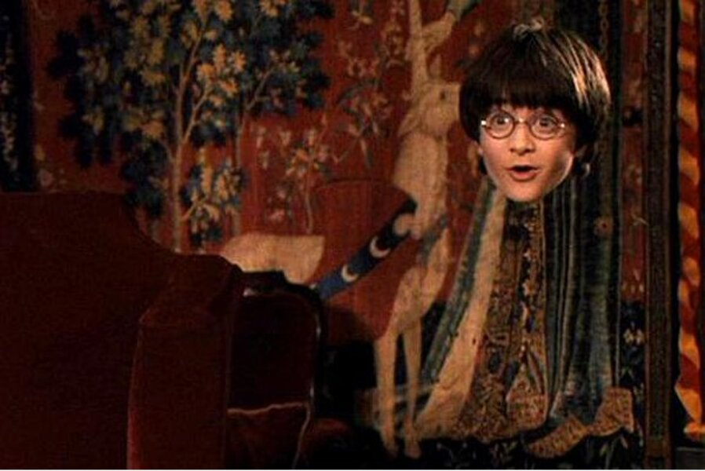

# Invisible-Cloak-through-Computer-Vision

Prerequisites for the cloth:
Choose a cloth of one color only and suppose the color of the cloth is red then ensure that your background does not contain any red color. Because if the background contains that color then it will cause problems.
In this project, we are using red color cloth but you can make any color we just have to change the values for the visibilities of the color and it can be changed easily.
Now After choosing the cloth we need to select IDE for this Project and install some of the Libraries to make this work.

The logic is very simple. We are extracting each frame of the video, with the help of segmentation.

-> Then we separate the background and foreground of the image. 

-> Then replace the foreground of a particular color with the background which gives the illusion of getting disappeared.

-> Here I have taken red colored cloth for getting disappeared, you can use any color of your choice.

Workflow of this project :

1. Importing needed libraries and generate the output video

2. Recording and caching the background for each frame.

3. Detecting the red portion in each frame

4. Replacing the red portion with a mask image in each frame

5. Producing the surprising output
